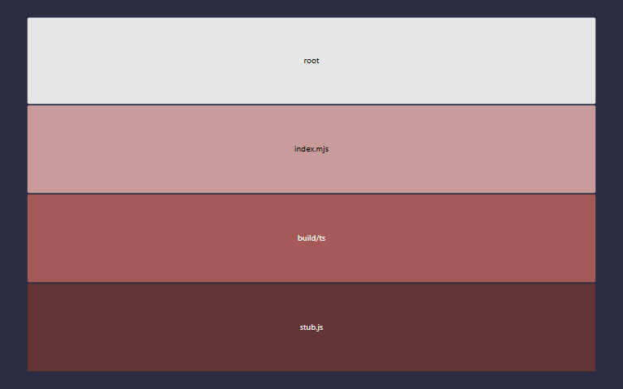

# react_ts_with_claude_gh_template v0.20.4

> Version 0.20.4 was built on Friday, June 5, 2026 at GMT-07:00 `1780725270359` from hash `34b4b4c`.

TODO Put the project description here, please.

<!-- Supported embeds: 1780725270359 Friday, June 5, 2026 at GMT-07:00 66.66 2 50 34b4b4c {{stochbranch}} 66.66 {{stochfunc}} {{stochline}} 4 43 {{unitbranch}} {{unitfunc}} {{unitline}} 39 0.20.4 -->

&nbsp;

&nbsp;

## Test status

<table>
  <tr>
    <th></th>
    <th>Count</th>
    <th>Statement</th>
    <th>Branch</th>
    <th>Func</th>
    <th>Line</th>
  </tr>
  <tr>
    <th>Unit</th>
    <td>39</td>
    <td>66.66<small>%</small></td>
    <td>{{unitbranch}}<small>%</small></td>
    <td>{{unitfunc}}<small>%</small></td>
    <td>{{unitline}}<small>%</small></td>
  </tr>
  <tr>
    <th>Stochastic</th>
    <td>4</td>
    <td>66.66<small>%</small></td>
    <td>{{stochbranch}}<small>%</small></td>
    <td>{{stochfunc}}<small>%</small></td>
    <td>{{stochline}}<small>%</small></td>
  </tr>
</table>

<table>
  <tr>
    <th></th>
    <th>Docblock count</th>
    <th>50<small>%</small></th>
  </tr>
  <tr>
    <th>Docblock coverage</th>
    <td>2</td>
    <td>50<small>%</small></td>
  </tr>
</table>

* [Site](https://stonecypher.github.io/react_ts_with_claude_gh_template/index.html)
* [Documentation](https://stonecypher.github.io/react_ts_with_claude_gh_template/docs/index.html)
* [Builds](https://www.github.com/stonecypher/react_ts_with_claude_gh_template/actions)
* [Source](https://www.github.com/stonecypher/react_ts_with_claude_gh_template/)

<table>
  <tr>
    <td></td>
    <td></td>
  </tr>
  <tr>
    <td></td>
    <td></td>
  </tr>
</table>

&nbsp;

&nbsp;

## How to use this template

&nbsp;

### Before invoking it

1. [ ] Decide whether to
    1. Update the deps in the template ***recommended***
    1. Update the deps post-install
    1. Let the deps be out of date

&nbsp;

### After invoking it

1. [ ] Reset package version
1. [ ] Turn Github Pages on, and point it at `master`/`/docs`
1. [ ] Set up the auth token `TODO_TOKEN_FOR_GH_CI_CD` after renaming it in ci.yml
1. [ ] Change all the `react_ts_with_claude_gh_template`s in this file's top block links
1. [ ] Change all the `react_ts_with_claude_gh_template`s in `package.json`
1. [ ] Change the `react_ts_with_claude_gh_template` in `verify_version_bump.js`
1. [ ] Write or copy-paste the description in `package.json`
1. [ ] Search for all remaining TODOs
1. [ ] Update meta tags and TODOs in `src/html/index.html`
1. [ ] Write a `base-README.md`
1. [ ] Change all the `react_ts_with_claude_gh_template`s in `rollup.config.js`
1. [ ] Decide whether to
    1. re-add a `bin` block to `package.json`, or
    2. remove the `bin` config from `rollup.config.js`
1. [ ] `npm install && npm run build`
    1. Maybe update the deps?
1. Handle the MAYBE-REMOVEs in the HTML HEAD
    1. [ ] Change src/html/index.html 's <title>
    1. [ ] Maybe replace src/html/favicon.png
1. [ ] commit and vroom

&nbsp;

&nbsp;

## License

MIT
