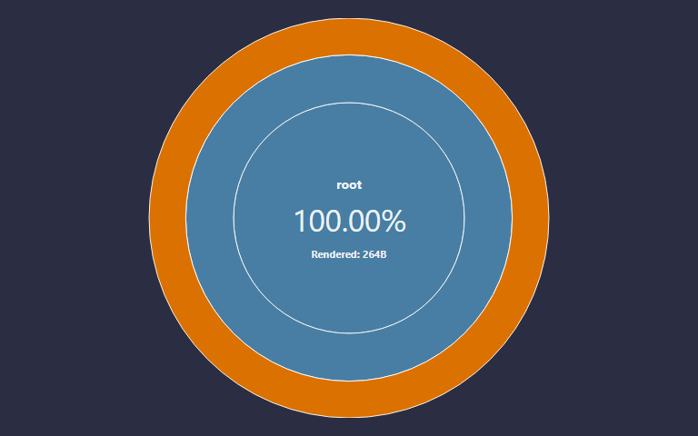
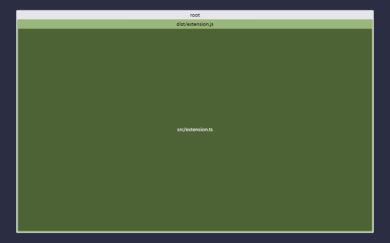

# FSL Markdown Preview v{{version}}

> Version {{version}} was built on {{built_text}} `{{built}}` from hash `{{gh_hash}}`.

A VS Code extension that renders ` ```fsl ` and ` ```jssm ` fenced code blocks in
the Markdown **preview** as live, interactive [FSL](https://github.com/StoneCypher/jssm)
state machines — the full `<fsl-instance>` IDE, minus the editor.

<!-- Supported embeds: {{built}} {{built_text}} {{coverage}} {{docblockcount}} {{doccoverage}} {{gh_hash}} {{stochcoverage}} {{stochtestcount}} {{testcasecount}} {{unittestcount}} {{version}} -->

&nbsp;

## Screenshot

> _Placeholder — a screenshot of a live ` ```fsl ` fence rendered as an interactive state-machine IDE in VS Code's Markdown preview belongs here. Add one before publishing to the Marketplace._

&nbsp;

## Quick example

Drop this into any `.md` file and open VS Code's Markdown preview (`Ctrl+Shift+V` / `Cmd+Shift+V`):

````markdown
```fsl width=400
Red -> Green -> Yellow -> Red;
```
````

The fence becomes a live, interactive traffic-light state machine — click an action button and watch the diagram re-render. `samples/demo.md` in this repo is a runnable walkthrough of every supported case: a plain fence, a sized fence, a non-`fsl` fence left as an ordinary code block, a broken fence's error box, and a stochastic machine (ready for when jssm ships its stochastic tooling).

&nbsp;

&nbsp;

## Test status

<table>
  <tr>
    <th></th>
    <th>Count</th>
    <th>Statement coverage</th>
  </tr>
  <tr>
    <th>Unit</th>
    <td>{{unittestcount}}</td>
    <td>{{coverage}}<small>%</small></td>
  </tr>
  <tr>
    <th>Stochastic</th>
    <td>{{stochtestcount}}</td>
    <td>{{stochcoverage}}<small>%</small></td>
  </tr>
</table>

<table>
  <tr>
    <th>Total test cases</th>
    <th>Documentable symbols</th>
    <th>Documentation coverage</th>
  </tr>
  <tr>
    <td>{{testcasecount}}</td>
    <td>{{docblockcount}}</td>
    <td>{{doccoverage}}<small>%</small></td>
  </tr>
</table>

* [Site](https://stonecypher.github.io/vscode-fsl/index.html)
* [Documentation](https://stonecypher.github.io/vscode-fsl/docs/index.html)
* [Builds](https://www.github.com/stonecypher/vscode-fsl/actions)
* [Source](https://www.github.com/stonecypher/vscode-fsl/)

<table>
  <tr>
    <td></td>
    <td></td>
    <td></td>
  </tr>
</table>

&nbsp;

&nbsp;

## Install

This extension isn't on the Marketplace yet — publishing is a separate, later, user-gated step. For now, build and install the `.vsix` locally:

```bash
npm install
npm run build
npx vsce package
code --install-extension vscode-fsl-0.1.0.vsix
```

Reload VS Code, open (or create) a Markdown file containing an ` ```fsl ` fence, and open its preview.

&nbsp;

## The fence convention

` ```fsl ` (synonym ` ```jssm `, case-insensitive) fences follow a portable grammar meant to work the same way across every Markdown host that chooses to support it — GitHub, static-site generators, future editors, and this extension. The full grammar, including the element/format tokens this extension ignores, lives in the [jssm fence-convention spec](https://www.github.com/stonecypher/vscode-fsl/blob/main/notes/superpowers/specs/2026-06-23-fsl-markdown-fence-convention-design.md).

| Token | Meaning | Honored here? |
|---|---|---|
| ` ```fsl ` / ` ```jssm ` | Fence language — activates this extension | Yes, required |
| `width=N` / `width=N%` | Panel width | Yes |
| `height=N` / `height=N%` | Panel height | Yes |
| `image` `code` `editor` `actions` `info-panel` `toolbar` `title` `footer` `ide` (element tokens) | Which slot(s) a *static* host renders | **Ignored** |
| `svg` `png` `jpeg` `dot` `gif` (format tokens) | Which output format a *static* host renders | **Ignored** |

This extension is deliberately the grammar's *maximalist* interpreter: VS Code already **is** the editor, so every valid fence always renders the full live `<fsl-instance>` IDE — viz, actions, toolbar, title, footer — **minus** the `editor` slot, no matter which element/format tokens the fence carries. Only `width=`/`height=` change anything here, because sizing is meaningful in any host. Write the other tokens for wherever else the same Markdown travels; this preview always shows the richest live version regardless.

&nbsp;

## Error handling

Invalid FSL never renders a silent blank. A bordered "FSL error" box appears with the parser's message, and the raw (escaped) source stays visible beneath it:

````markdown
```fsl
this is not -> valid ->;
```
````

&nbsp;

## Theming

The **live** diagram and IDE chrome follow VS Code's active color theme — light, dark, and both high-contrast variants — automatically, with no reload; switch themes and the diagram restyles in place.

The very first frame you see is different: it's rendered host-side (outside any webview, before a theme is knowable) and shown immediately so the preview never sits blank. That first-paint SVG uses Graphviz's default light palette on a white ground and does **not** follow the VS Code theme — a deliberate, documented compromise. It swaps automatically for the theme-aware live diagram about a second later, once the in-webview engine finishes its own first render; there's no flash or visible seam.

&nbsp;

## Known issues (0.1.0)

- **Unsized diagrams can still overflow.** A fence with no `height=` token is capped at a default viewport-scale height, but a very tall/narrow machine's *live* diagram can still spill past that cap in some cases. Upstream bug: [fsl#1934](https://www.github.com/stonecypher/fsl/issues/1934); [fsl#1937](https://www.github.com/stonecypher/fsl/issues/1937) tracks a future `max-width=`/`max-height=` fence token this extension would consume once it ships. Workaround: give the fence an explicit `height=` (or `width=`) token.
- **No `info-panel` slot.** jssm 5.157.x doesn't yet register the `fsl-info-panel` component, so this extension holds that slot out of the live IDE entirely for 0.1.0 rather than render an empty gap — [fsl#1939](https://www.github.com/stonecypher/fsl/issues/1939). When jssm ships the component, a small code change here (adding the panel to `src/preview/hydrate.ts`'s `PANELS` array) will restore it.
- **No Stochastic toolbar control.** jssm 5.157.x's toolbar offers Validate, Lint, Layout, Export, and Theme — there's no Stochastic action to enable or disable for a stochastic machine in this version; the control doesn't exist yet upstream.

&nbsp;

## Development

```bash
npm install
npm run build      # full pipeline: tests, typecheck, lint, bundle, TypeDoc, changelog, site
npx vitest run      # just the unit suite — faster, for iteration
npm run just_test   # unit + stochastic + mutation-config
```

`npm test` currently runs the same full pipeline as `npm run build`, not a quick test-only pass — use `npx vitest run` while iterating, or `npm run just_test` for comprehensive test coverage including stochastic tests.

Press **F5** in VS Code to launch the Extension Development Host (`.vscode/launch.json`), then open a Markdown file with an `fsl`/`jssm` fence and preview it.

&nbsp;

&nbsp;

## License

MIT
